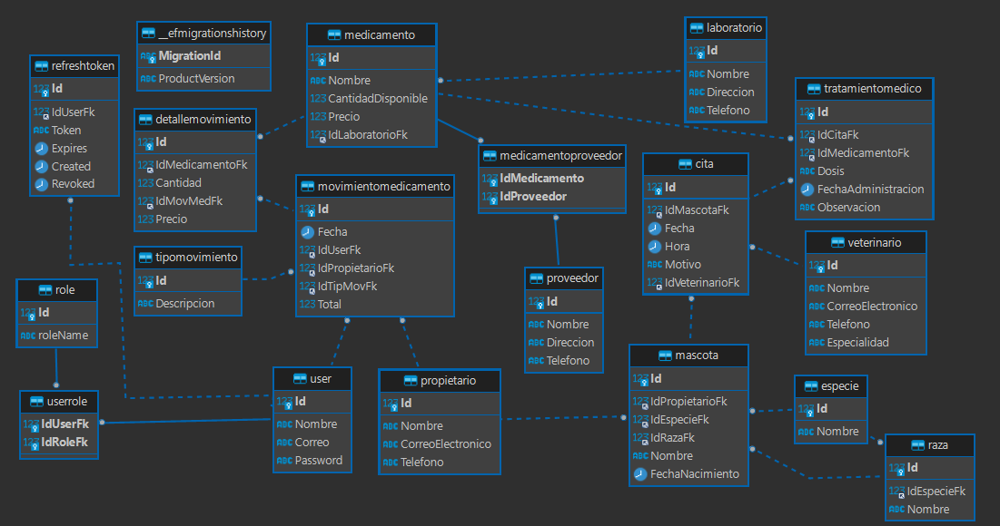

# Veterinaria API 🐱

Gestion de Veterinaria:

El proyecto de desarrollo de software tiene como objetivo principal la creación de un sistema de administración para una veterinaria. Este sistema permitirá a los administradores y al personal de la veterinaria gestionar de manera eficiente y efectiva todas las actividades relacionadas con la atención de mascotas y la gestión de clientes.

El sistema contará con diferentes módulos que abarcarán áreas clave como el registro de pacientes, la programación de citas, el seguimiento de tratamientos médicos, la gestión de inventario de medicamentos y productos, así como la generación de reportes y estadísticas relevantes para la toma de decisiones.

El proyecto de administración de veterinaria tiene como objetivo mejorar la eficiencia y la experiencia del cliente, al tiempo que facilita la gestión interna de la veterinaria. Se espera que este sistema contribuya positivamente al crecimiento y éxito del negocio.

## Badges ⚜️

[](https://github.com)
[](https://dotnet.microsoft.com/)
[](https://https://nuget.org/)
[](https://learn.microsoft.com/es-es/dotnet/csharp/)
[](https://www.mysql.com/)

**Table of Contents**📑

[TOCM]

[TOC]

## Requerimientos Funcionales 🌟

1. Autenticación y autorización:
    - El sistema debe implementar protección en los endpoints utilizando JWT (JSON Web Tokens). El token tiene una duracion de 1 minuto.
    - Se debe implementar refresh token.
    - Debe restringir las peticiones a los endpoints según los roles de los usuarios.
2. Se debe permitir realizar procesos de creacion, edicion, eliminacion y listado de informacion de cada una de las tablas.
3. El backend debe permitir restringir peticiones consecutivos usando tecnicas de limitacion por IP.
4. El backend debe permitir realizar la paginacion en las peticiones get de todos los controladores.
5. Los controladores deben implementar 2 versiones diferentes (Query y Header)

## Consultas Propuestas 📋

1. Crear un consulta que permita visualizar los veterinarios cuya especialidad sea Cirujano vascular.
2. Listar los medicamentos que pertenezcan a el laboratorio Genfar
3. Mostrar las mascotas que se encuentren registradas cuya especie sea felina.
4. Listar los propietarios y sus mascotas.
5. Listar los medicamentos que tenga un precio de venta mayor a 50000
6. Listar las mascotas que fueron atendidas por motivo de vacunacion en el primer trimestre del 2023
7. Listar todas las mascotas agrupadas por especie.
8. Listar todos los movimientos de medicamentos y el valor total de cada movimiento.
9. Listar las mascotas que fueron atendidas por un determinado veterinario.
10. Listar los proveedores que me venden un determinado medicamento.
11. Listar las mascotas y sus propietarios cuya raza sea Golden Retriver
12. Listar la cantidad de mascotas que pertenecen a una raza a una raza.
        Nota: Se debe mostrar una lista de las razas y la cantidad de mascotas que pertenecen a la raza.

## Versiones Disponibles 📈
Se implementa la seleccion de version a usar desde Query y Header
1. V1.0
    Incluyen los endpoints genericos y consultas especificas sin paginado.

2. V1.1
    Incluyen los endpoints de consultas genericas con paginacion y especificos con paginacion.


## Uso 🕹

Con la API en ejecucion se pueden encontrar 3 grupos principales de endpoints. Relacionados a USUARIOS, genericos y especificos.
**Versionado**
Para la implementacion de las versiones se puede realizar desde Header como en la imagen o desde Query con la key ver=1.0


**Paginado**
Para realizar la paginación se va al apartado de "Query" y se ingresa lo siguiente:


### Endpoints de Usuario

#### 1. Registro de Usuario
Este endpoint permite a los usuarios registrarse en el sistema.
**Endpoint**: `http://localhost:5051/api/User/register`
**Version**: `1.0`
```JSON
{
    "nombre": "<nombre_de_usuario>",
    "password": "<password>",
    "correo": "<Email>"
}

```

#### 2. Generacion de Tokken
Una vez registrado el usuario tendrá que ingresar para recibir un token, este será ingresado al siguiente Endpoint que es el de Refresh Token.
**Endpoint**: `http://localhost:5051/api/User/token`
**Version**: `1.0`
```JSON
{
    "nombre": "<nombre_de_usuario>",
    "password": "<password>"
}
```

####  3. Refresh Token
Este endpoint permite actualizar el token el cual expira cada minuto.

Se dejan los mismos datos en el Body y luego se ingresa al "Auth", "Bearer", allí se ingresa el token obtenido en el anterior Endpoint.
**Endpoint**: `http://localhost:5051/api/User/refresh-token`
**Version**: `1.0`

#### 4. Asignacion de Rol
Permite asignarle un rol diferente al usuario del predeterminado el cual es "empleado".
**Endpoint**: `http://localhost:5051/api/User/addrole`
**Version**: `1.0`
```JSON
{
    "nombre": "<nombre_de_usuario>",
    "password": "<password>",
    "role": "<role>"
}
```

**Otros Endpoints**

- Obtener Todos los Usuarios: GET.
**Endpoint**: `http://localhost:5165/api//User`

- Obtener Usuario por ID: GET.
**Endpoint**: `http://localhost:5165/api/User/{id}`

- Actualizar Usuario: PUT.
**Endpoint**: `http://localhost:5165/api/User/{id}`

- Eliminar Usuario: DELETE.
**Endpoint**: `http://localhost:5165/api/User/{id}`


### Endpoints Especificos ✅
Para el desarrollo de las consultas se analizaron las variables de estas para dar flexibilidad al desarrollo de estas.

#### 1. Crear un consulta que permita visualizar los veterinarios cuya especialidad sea Cirujano vascular.
**Version**: `1.0`
**Version**: `1.1`

#### 2. Listar los medicamentos que pertenezcan a el laboratorio Genfar
**Version**: `1.0`
**Version**: `1.1`

#### 3. Mostrar las mascotas que se encuentren registradas cuya especie sea felina.
**Version**: `1.0`
**Version**: `1.1`

#### 4. Listar los propietarios y sus mascotas.
**Version**: `1.0`
**Version**: `1.1`

#### 5. Listar los medicamentos que tenga un precio de venta mayor a 50000
**Version**: `1.0`
**Version**: `1.1`

#### 6. Listar las mascotas que fueron atendidas por motivo de vacunacion en el primer trimestre del 2023
**Version**: `1.0`
**Version**: `1.1`

#### 7. Listar todas las mascotas agrupadas por especie.
**Version**: `1.0`
**Version**: `1.1`

#### 8. Listar todos los movimientos de medicamentos y el valor total de cada movimiento.
**Version**: `1.0`
**Version**: `1.1`

#### 9. Listar las mascotas que fueron atendidas por un determinado veterinario.
**Version**: `1.0`
**Version**: `1.1`

#### 10. Listar los proveedores que me venden un determinado medicamento.
**Version**: `1.0`
**Version**: `1.1`

#### 11. Listar las mascotas y sus propietarios cuya raza sea Golden Retriver.
**Version**: `1.0`
**Version**: `1.1`

#### 12. Listar la cantidad de mascotas que pertenecen a una raza a una raza.
**Version**: `1.0`
**Version**: `1.1`

## Tecnologias 💻

-   NetCore 7.0
-   MySQL
-   GitHub

### Lenguajes Usados 💬

-   C#

### Dependencias Usadas 📦

-   "AspNetCoreRateLimit" Version="5.0.0"
-   "AutoMapper.Extensions.Microsoft.DependencyInjection" Version="12.0.1"
-   "Microsoft.AspNetCore.Authentication.JwtBearer" Version="7.0.12"
-   "Microsoft.AspNetCore.Mvc.Versioning" Version="5.1.0"
-   "Microsoft.AspNetCore.OpenApi" Version="7.0.12"
-   "Microsoft.EntityFrameworkCore" Version="7.0.12"
-   "Microsoft.EntityFrameworkCore.Design" Version="7.0.12">
-   "Microsoft.Extensions.DependencyInjection" Version="7.0.0"
-   "Swashbuckle.AspNetCore" Version="6.5.0"
-   "System.IdentityModel.Tokens.Jwt" Version="7.0.3"
-   "Microsoft.IdentityModel.Tokens" Version="7.0.3"
-   "Serilog.AspNetCore" Version="7.0.0"
-   "FluentValidation.AspNetCore" Version="11.3.0"
-   "itext7.pdfhtml" Version="5.0.1"
-   "Pomelo.EntityFrameworkCore.MySql" Version="7.0.0"
-   "CsvHelper" Version="30.0.1"

## Estructura de la DataBase 🧱

> Estructura General.


```SQL
CREATE DATABASE `veterinariadb` /*!40100 DEFAULT CHARACTER SET utf8mb4 COLLATE utf8mb4_general_ci */;
-- veterinariadb.especie definition

CREATE TABLE `especie` (
  `Id` int(11) NOT NULL AUTO_INCREMENT,
  `Nombre` varchar(50) NOT NULL,
  PRIMARY KEY (`Id`)
) ENGINE=InnoDB AUTO_INCREMENT=5 DEFAULT CHARSET=utf8mb4 COLLATE=utf8mb4_general_ci;


-- veterinariadb.laboratorio definition

CREATE TABLE `laboratorio` (
  `Id` int(11) NOT NULL AUTO_INCREMENT,
  `Nombre` varchar(50) NOT NULL,
  `Direccion` varchar(100) NOT NULL,
  `Telefono` varchar(20) NOT NULL,
  PRIMARY KEY (`Id`)
) ENGINE=InnoDB AUTO_INCREMENT=4 DEFAULT CHARSET=utf8mb4 COLLATE=utf8mb4_general_ci;


-- veterinariadb.propietario definition

CREATE TABLE `propietario` (
  `Id` int(11) NOT NULL AUTO_INCREMENT,
  `Nombre` varchar(50) NOT NULL,
  `CorreoElectronico` varchar(100) NOT NULL,
  `Telefono` varchar(20) NOT NULL,
  PRIMARY KEY (`Id`)
) ENGINE=InnoDB AUTO_INCREMENT=5 DEFAULT CHARSET=utf8mb4 COLLATE=utf8mb4_general_ci;


-- veterinariadb.proveedor definition

CREATE TABLE `proveedor` (
  `Id` int(11) NOT NULL AUTO_INCREMENT,
  `Nombre` varchar(50) NOT NULL,
  `Direccion` varchar(50) NOT NULL,
  `Telefono` varchar(20) NOT NULL,
  PRIMARY KEY (`Id`)
) ENGINE=InnoDB AUTO_INCREMENT=4 DEFAULT CHARSET=utf8mb4 COLLATE=utf8mb4_general_ci;


-- veterinariadb.`role` definition

CREATE TABLE `role` (
  `Id` int(11) NOT NULL AUTO_INCREMENT,
  `roleName` varchar(50) NOT NULL,
  PRIMARY KEY (`Id`)
) ENGINE=InnoDB AUTO_INCREMENT=3 DEFAULT CHARSET=utf8mb4 COLLATE=utf8mb4_general_ci;


-- veterinariadb.tipomovimiento definition

CREATE TABLE `tipomovimiento` (
  `Id` int(11) NOT NULL AUTO_INCREMENT,
  `Descripcion` varchar(50) NOT NULL,
  PRIMARY KEY (`Id`)
) ENGINE=InnoDB AUTO_INCREMENT=4 DEFAULT CHARSET=utf8mb4 COLLATE=utf8mb4_general_ci;


-- veterinariadb.`user` definition

CREATE TABLE `user` (
  `Id` int(11) NOT NULL AUTO_INCREMENT,
  `Nombre` varchar(50) NOT NULL,
  `Correo` varchar(100) NOT NULL,
  `Password` varchar(255) NOT NULL,
  PRIMARY KEY (`Id`)
) ENGINE=InnoDB AUTO_INCREMENT=5 DEFAULT CHARSET=utf8mb4 COLLATE=utf8mb4_general_ci;


-- veterinariadb.veterinario definition

CREATE TABLE `veterinario` (
  `Id` int(11) NOT NULL AUTO_INCREMENT,
  `Nombre` varchar(50) NOT NULL,
  `CorreoElectronico` varchar(100) NOT NULL,
  `Telefono` varchar(20) NOT NULL,
  `Especialidad` varchar(50) NOT NULL,
  PRIMARY KEY (`Id`)
) ENGINE=InnoDB AUTO_INCREMENT=5 DEFAULT CHARSET=utf8mb4 COLLATE=utf8mb4_general_ci;


-- veterinariadb.medicamento definition

CREATE TABLE `medicamento` (
  `Id` int(11) NOT NULL AUTO_INCREMENT,
  `Nombre` varchar(50) NOT NULL,
  `CantidadDisponible` int(11) NOT NULL,
  `Precio` int(11) NOT NULL,
  `IdLaboratorioFk` int(11) NOT NULL,
  PRIMARY KEY (`Id`),
  KEY `IX_medicamento_IdLaboratorioFk` (`IdLaboratorioFk`),
  CONSTRAINT `FK_medicamento_laboratorio_IdLaboratorioFk` FOREIGN KEY (`IdLaboratorioFk`) REFERENCES `laboratorio` (`Id`) ON DELETE CASCADE
) ENGINE=InnoDB AUTO_INCREMENT=4 DEFAULT CHARSET=utf8mb4 COLLATE=utf8mb4_general_ci;


-- veterinariadb.medicamentoproveedor definition

CREATE TABLE `medicamentoproveedor` (
  `IdMedicamento` int(11) NOT NULL,
  `IdProveedor` int(11) NOT NULL,
  PRIMARY KEY (`IdProveedor`,`IdMedicamento`),
  KEY `IX_medicamentoProveedor_IdMedicamento` (`IdMedicamento`),
  CONSTRAINT `FK_medicamentoProveedor_medicamento_IdMedicamento` FOREIGN KEY (`IdMedicamento`) REFERENCES `medicamento` (`Id`) ON DELETE CASCADE,
  CONSTRAINT `FK_medicamentoProveedor_proveedor_IdProveedor` FOREIGN KEY (`IdProveedor`) REFERENCES `proveedor` (`Id`) ON DELETE CASCADE
) ENGINE=InnoDB DEFAULT CHARSET=utf8mb4 COLLATE=utf8mb4_general_ci;


-- veterinariadb.movimientomedicamento definition

CREATE TABLE `movimientomedicamento` (
  `Id` int(11) NOT NULL AUTO_INCREMENT,
  `Fecha` date NOT NULL,
  `IdUserFk` int(11) NOT NULL,
  `IdPropietarioFk` int(11) NOT NULL,
  `IdTipMovFk` int(11) NOT NULL,
  `Total` int(11) NOT NULL,
  PRIMARY KEY (`Id`),
  KEY `IX_movimientoMedicamento_IdPropietarioFk` (`IdPropietarioFk`),
  KEY `IX_movimientoMedicamento_IdTipMovFk` (`IdTipMovFk`),
  KEY `IX_movimientoMedicamento_IdUserFk` (`IdUserFk`),
  CONSTRAINT `FK_movimientoMedicamento_propietario_IdPropietarioFk` FOREIGN KEY (`IdPropietarioFk`) REFERENCES `propietario` (`Id`) ON DELETE CASCADE,
  CONSTRAINT `FK_movimientoMedicamento_tipoMovimiento_IdTipMovFk` FOREIGN KEY (`IdTipMovFk`) REFERENCES `tipomovimiento` (`Id`) ON DELETE CASCADE,
  CONSTRAINT `FK_movimientoMedicamento_user_IdUserFk` FOREIGN KEY (`IdUserFk`) REFERENCES `user` (`Id`) ON DELETE CASCADE
) ENGINE=InnoDB AUTO_INCREMENT=4 DEFAULT CHARSET=utf8mb4 COLLATE=utf8mb4_general_ci;


-- veterinariadb.raza definition

CREATE TABLE `raza` (
  `Id` int(11) NOT NULL AUTO_INCREMENT,
  `IdEspecieFk` int(11) NOT NULL,
  `Nombre` varchar(50) NOT NULL,
  PRIMARY KEY (`Id`),
  KEY `IX_raza_IdEspecieFk` (`IdEspecieFk`),
  CONSTRAINT `FK_raza_especie_IdEspecieFk` FOREIGN KEY (`IdEspecieFk`) REFERENCES `especie` (`Id`) ON DELETE CASCADE
) ENGINE=InnoDB AUTO_INCREMENT=6 DEFAULT CHARSET=utf8mb4 COLLATE=utf8mb4_general_ci;


-- veterinariadb.refreshtoken definition

CREATE TABLE `refreshtoken` (
  `Id` int(11) NOT NULL AUTO_INCREMENT,
  `IdUserFk` int(11) NOT NULL,
  `Token` longtext DEFAULT NULL,
  `Expires` datetime(6) NOT NULL,
  `Created` datetime(6) NOT NULL,
  `Revoked` datetime(6) DEFAULT NULL,
  PRIMARY KEY (`Id`),
  KEY `IX_RefreshToken_IdUserFk` (`IdUserFk`),
  CONSTRAINT `FK_RefreshToken_user_IdUserFk` FOREIGN KEY (`IdUserFk`) REFERENCES `user` (`Id`) ON DELETE CASCADE
) ENGINE=InnoDB AUTO_INCREMENT=4 DEFAULT CHARSET=utf8mb4 COLLATE=utf8mb4_general_ci;


-- veterinariadb.userrole definition

CREATE TABLE `userrole` (
  `IdUserFk` int(11) NOT NULL,
  `IdRoleFk` int(11) NOT NULL,
  PRIMARY KEY (`IdRoleFk`,`IdUserFk`),
  KEY `IX_userrole_IdUserFk` (`IdUserFk`),
  CONSTRAINT `FK_userrole_role_IdRoleFk` FOREIGN KEY (`IdRoleFk`) REFERENCES `role` (`Id`) ON DELETE CASCADE,
  CONSTRAINT `FK_userrole_user_IdUserFk` FOREIGN KEY (`IdUserFk`) REFERENCES `user` (`Id`) ON DELETE CASCADE
) ENGINE=InnoDB DEFAULT CHARSET=utf8mb4 COLLATE=utf8mb4_general_ci;


-- veterinariadb.detallemovimiento definition

CREATE TABLE `detallemovimiento` (
  `Id` int(11) NOT NULL AUTO_INCREMENT,
  `IdMedicamentoFk` int(11) NOT NULL,
  `Cantidad` int(11) NOT NULL,
  `IdMovMedFk` int(11) NOT NULL,
  `Precio` int(11) NOT NULL,
  PRIMARY KEY (`Id`),
  KEY `IX_detalleMovimiento_IdMedicamentoFk` (`IdMedicamentoFk`),
  KEY `IX_detalleMovimiento_IdMovMedFk` (`IdMovMedFk`),
  CONSTRAINT `FK_detalleMovimiento_medicamento_IdMedicamentoFk` FOREIGN KEY (`IdMedicamentoFk`) REFERENCES `medicamento` (`Id`) ON DELETE CASCADE,
  CONSTRAINT `FK_detalleMovimiento_movimientoMedicamento_IdMovMedFk` FOREIGN KEY (`IdMovMedFk`) REFERENCES `movimientomedicamento` (`Id`) ON DELETE CASCADE
) ENGINE=InnoDB AUTO_INCREMENT=4 DEFAULT CHARSET=utf8mb4 COLLATE=utf8mb4_general_ci;


-- veterinariadb.mascota definition

CREATE TABLE `mascota` (
  `Id` int(11) NOT NULL AUTO_INCREMENT,
  `IdPropietarioFk` int(11) NOT NULL,
  `IdEspecieFk` int(11) NOT NULL,
  `IdRazaFk` int(11) NOT NULL,
  `Nombre` varchar(20) NOT NULL,
  `FechaNacimiento` date NOT NULL,
  PRIMARY KEY (`Id`),
  KEY `IX_mascota_IdEspecieFk` (`IdEspecieFk`),
  KEY `IX_mascota_IdPropietarioFk` (`IdPropietarioFk`),
  KEY `IX_mascota_IdRazaFk` (`IdRazaFk`),
  CONSTRAINT `FK_mascota_especie_IdEspecieFk` FOREIGN KEY (`IdEspecieFk`) REFERENCES `especie` (`Id`) ON DELETE CASCADE,
  CONSTRAINT `FK_mascota_propietario_IdPropietarioFk` FOREIGN KEY (`IdPropietarioFk`) REFERENCES `propietario` (`Id`) ON DELETE CASCADE,
  CONSTRAINT `FK_mascota_raza_IdRazaFk` FOREIGN KEY (`IdRazaFk`) REFERENCES `raza` (`Id`) ON DELETE CASCADE
) ENGINE=InnoDB AUTO_INCREMENT=7 DEFAULT CHARSET=utf8mb4 COLLATE=utf8mb4_general_ci;


-- veterinariadb.cita definition

CREATE TABLE `cita` (
  `Id` int(11) NOT NULL AUTO_INCREMENT,
  `IdMascotaFk` int(11) NOT NULL,
  `Fecha` date NOT NULL,
  `Hora` time NOT NULL,
  `Motivo` varchar(250) NOT NULL,
  `IdVeterinarioFk` int(11) NOT NULL,
  PRIMARY KEY (`Id`),
  KEY `IX_cita_IdMascotaFk` (`IdMascotaFk`),
  KEY `IX_cita_IdVeterinarioFk` (`IdVeterinarioFk`),
  CONSTRAINT `FK_cita_mascota_IdMascotaFk` FOREIGN KEY (`IdMascotaFk`) REFERENCES `mascota` (`Id`) ON DELETE CASCADE,
  CONSTRAINT `FK_cita_veterinario_IdVeterinarioFk` FOREIGN KEY (`IdVeterinarioFk`) REFERENCES `veterinario` (`Id`) ON DELETE CASCADE
) ENGINE=InnoDB AUTO_INCREMENT=4 DEFAULT CHARSET=utf8mb4 COLLATE=utf8mb4_general_ci;


-- veterinariadb.tratamientomedico definition

CREATE TABLE `tratamientomedico` (
  `Id` int(11) NOT NULL AUTO_INCREMENT,
  `IdCitaFk` int(11) NOT NULL,
  `IdMedicamentoFk` int(11) NOT NULL,
  `Dosis` varchar(50) NOT NULL,
  `FechaAdministracion` date NOT NULL,
  `Observacion` varchar(50) NOT NULL,
  PRIMARY KEY (`Id`),
  KEY `IX_tratamientoMedico_IdCitaFk` (`IdCitaFk`),
  KEY `IX_tratamientoMedico_IdMedicamentoFk` (`IdMedicamentoFk`),
  CONSTRAINT `FK_tratamientoMedico_cita_IdCitaFk` FOREIGN KEY (`IdCitaFk`) REFERENCES `cita` (`Id`) ON DELETE CASCADE,
  CONSTRAINT `FK_tratamientoMedico_medicamento_IdMedicamentoFk` FOREIGN KEY (`IdMedicamentoFk`) REFERENCES `medicamento` (`Id`) ON DELETE CASCADE
) ENGINE=InnoDB AUTO_INCREMENT=4 DEFAULT CHARSET=utf8mb4 COLLATE=utf8mb4_general_ci;
```
